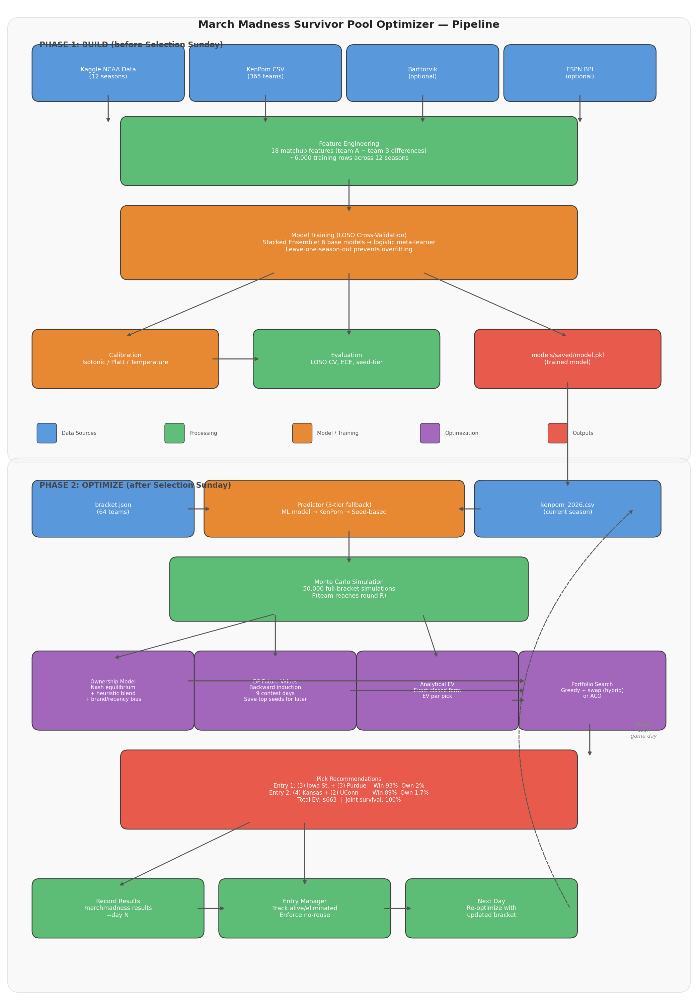

# March Madness Survivor Pool Optimizer

Maximize expected value in NCAA tournament survivor pools. Pick teams each day to win straight-up — if any pick loses, you're eliminated. Last survivor(s) split the pot.

This isn't a bracket contest optimizer. It's built specifically for **survivor pools** where the key decisions are: which team(s) to pick each day, when to burn a top team vs. save it, and how to differentiate across multiple entries. Supports **double-pick days** where both picks must win to survive.

## Quick Start

```bash
# Install
pip install -e ".[dev]"

# Before bracket is announced — train on historical data
marchmadness download        # Kaggle NCAA data (2013-2025)
marchmadness features        # Build KenPom-style feature matrix
marchmadness train           # Train model (default: xgboost, or set in config.yaml)
marchmadness evaluate        # Verify calibration
marchmadness backtest        # Replay 2015-2024 tournaments

# After Selection Sunday — optimize picks
marchmadness simulate        # Monte Carlo advancement probabilities
marchmadness schedule        # View the 9-day contest schedule
marchmadness optimize --day 1 --method hybrid

# During tournament
marchmadness results --day 1 <winning_team_ids>
marchmadness optimize --day 2
marchmadness status
```

Requires Python >= 3.11 and a [Kaggle API key](https://www.kaggle.com/docs/api) for data download.

### Docker

```bash
# Build the image
docker build -t marchmadness .

# Run any command
docker run --rm marchmadness schedule
docker run --rm \
  -v $(pwd)/data:/app/data \
  -v $(pwd)/config.yaml:/app/config.yaml \
  -v $(pwd)/entries:/app/entries \
  marchmadness optimize --day 1 --method hybrid

# Override pool settings on the fly (defaults: 10k pool, 150 max/user)
docker run --rm \
  -v $(pwd)/data:/app/data \
  -v $(pwd)/config.yaml:/app/config.yaml \
  -v $(pwd)/entries:/app/entries \
  marchmadness optimize --day 1 --pool-size 22000 --num-entries 5 --max-entries 150

# Run tests
docker run --rm --entrypoint pytest marchmadness -v
```

Or use the Makefile:

```bash
make build                  # Build Docker image
make test                   # Run 212 tests
make lint                   # Ruff lint check (zero violations)
make format                 # Ruff format check
make simulate               # 50k Monte Carlo sims
make optimize-day1          # Day 1 picks (uses config.yaml)
make optimize-day2          # Day 2 picks
make optimize-all           # Both R64 days

# Override pool settings
make optimize-day1 POOL_SIZE=22000 NUM_ENTRIES=5 MAX_ENTRIES=150
```

The Docker image uses Python 3.12 and includes all dependencies. Mount your `data/`, `entries/`, and `config.yaml` to persist state between runs.

## How It Works

The system has two phases: **build** (train the model before the bracket is announced) and **optimize** (generate picks once you have the bracket). Each phase can run independently — you can skip training entirely and use just KenPom ratings.

### End-to-End Pipeline



```
PHASE 1: BUILD (before Selection Sunday)

  Kaggle CSVs ──→ Feature Engineering ──→ Training ──→ Evaluation
  (12 seasons)    (20 matchup features)   (6 models)   (LOSO CV)
                                              │
                                              ▼
                                        models/saved/model.pkl

PHASE 2: OPTIMIZE (after Selection Sunday)

  bracket.json ──→ Predictor ──→ MC Simulation ──→ Optimizer ──→ Picks
  (64 teams)       (3-tier      (50k tournament   (EV + Nash +
                    fallback)    simulations)       DP + ACO)
```

### Phase 1: Building the Model

#### Step 1 — Download historical data (`marchmadness download`)

Downloads 12 seasons of NCAA tournament data from Kaggle (2013-2025, excluding 2020). Five CSV files land in `data/raw/`:

- **MRegularSeasonDetailedResults.csv** — every regular season game with box score stats (FGA, FTA, rebounds, turnovers, etc.)
- **MNCAATourneyCompactResults.csv** — tournament game outcomes (who won, scores)
- **MNCAATourneySeeds.csv** — tournament seeding (which teams got which seeds)
- **MMasseyOrdinals.csv** — composite rankings from 100+ ranking systems at Selection Sunday
- **MTeams.csv** — team ID ↔ name mapping

#### Step 2 — Engineer features (`marchmadness features`)

Transforms raw box scores into 20 matchup features. Each feature is a **difference** between the two teams (TeamA minus TeamB), so the model learns which gaps matter most.

**From box scores** → the feature pipeline computes KenPom-style efficiency stats for every team in every season:
- Offensive/defensive efficiency (points per 100 possessions, adjusted for opponent strength)
- Iterative SOS adjustment (10 rounds of opponent-strength normalization)
- Scoring margin consistency (std dev of per-game efficiency margins)

**From tournament seeds** → seed difference, tournament experience (appearances in prior 5 years)

**From Massey Ordinals** → composite ranking averaged across all ranking systems at Selection Sunday

**From external sources** (optional) → Barttorvik T-Rank (Barthag, WAB), ESPN BPI ratings, and Vegas betting lines (spread, over/under). These are fetched separately and merged if available — the model defaults missing values to 0.

| Feature | Source | What it captures |
|---------|--------|-----------------|
| SeedDiff | Tournament seeding | Committee ranking |
| AdjEMDiff | KenPom / box scores | Overall team strength |
| AdjODiff | KenPom / box scores | Offensive efficiency |
| AdjDDiff | KenPom / box scores | Defensive efficiency |
| AdjTAvg | KenPom / box scores | Game tempo |
| SOSDiff | KenPom / box scores | Strength of schedule |
| WinPctDiff | Season record | Win percentage |
| MasseyRankDiff | Massey Ordinals | Composite ranking |
| TourneyExpDiff | Historical seeds | Tournament experience |
| LuckDiff | Box scores / KenPom | Win% minus Pythagorean expected win% |
| CloseGameDiff | Box scores | Win% in games decided by ≤ 5 points |
| SeedRoundInteraction | Derived | Seed advantage amplified by round |
| AdjEMStdDiff | Box scores | Scoring margin consistency |
| BarthagDiff | Barttorvik | Predicted win% vs average D-I team |
| WABDiff | Barttorvik | Wins Above Bubble (quality metric) |
| BPIDiff | ESPN BPI | Independent power index rating |
| BPIOffDiff | ESPN BPI | Offensive strength per 70 possessions |
| BPIDefDiff | ESPN BPI | Defensive strength per 70 possessions |
| VegasSpread | Vegas lines | Closing point spread (best predictor) |
| VegasOU | Vegas lines | Over/under total (pace/style proxy) |

Each tournament game produces two training rows (A-vs-B and B-vs-A for symmetry), giving ~6,000-7,000 rows across 12 seasons. Output: `data/processed/matchup_features.parquet`.

External features are optional — fetch them with:
```bash
marchmadness fetch-bpi          # ESPN BPI (free, no auth)
marchmadness fetch-barttorvik   # Barttorvik T-Rank (free, may need manual CSV)
marchmadness fetch-odds         # Live Vegas lines (free API key from the-odds-api.com)
```

#### Step 3 — Train the model (`marchmadness train`)

Eight model types are available, configured via `model.type` in `config.yaml`:

| Model | Type | Notes |
|-------|------|-------|
| `stacked` | Stacked ensemble | **Default.** 6 base models + logistic meta-learner |
| `xgboost` | Gradient boosting | Good standalone performance |
| `lightgbm` | Gradient boosting | Fast training, handles categorical features |
| `catboost` | Gradient boosting | Built-in categorical support |
| `randomforest` | Bagging | Robust, less prone to overfitting |
| `logistic` | Linear | Baseline, uses StandardScaler |
| `naivebayes` | Probabilistic | Fast, uses StandardScaler |
| `ensemble` | Simple average | Average of logistic + XGBoost |

**How the stacked ensemble trains:**

1. **Leave-One-Season-Out (LOSO)**: For each of the 12 holdout seasons, train all 6 base models on the other 11 seasons. Generate out-of-fold predictions — a 6-column matrix where each column is one model's predicted win probability.
2. **Meta-learner**: Train a logistic regression on the out-of-fold prediction matrix to learn optimal model weights. This prevents overfitting because each prediction was made without seeing that season's data.
3. **Final models**: Retrain all 6 base models on the full dataset for inference.
4. **At prediction time**: Feed a matchup through all 6 base models → stack their outputs → meta-learner produces the final probability.

Scale-sensitive models (Logistic Regression, Gaussian Naive Bayes, stacked meta-learner) use `StandardScaler` via sklearn `Pipeline` to handle the wide feature scale range (BarthagDiff ±0.9 vs MasseyRankDiff ±300). The scaler is fitted per CV fold to prevent data leakage. Tree-based models are scale-invariant and left unnormalized.

**Calibration** ensures a predicted 70% probability actually wins ~70% of the time:
- **Isotonic** (default) — non-parametric calibration via `CalibratedClassifierCV`
- **Platt scaling** (`calibrate: "sigmoid"`) — parametric logistic calibration
- **Temperature scaling** (`calibrate: "temperature"`) — learns a single parameter T on LOSO out-of-fold predictions to minimize log-loss

Output: `models/saved/model.pkl` (pickled model, loadable at prediction time).

#### Step 4 — Evaluate (`marchmadness evaluate`)

Runs full LOSO cross-validation and reports:
- **Per-season log-loss and Brier score** — measures prediction accuracy for each holdout year
- **Seed-tier calibration** — groups matchups into Blowout (1-4 vs 13-16), Competitive (5-8 vs 9-12), and Close (same tier) buckets, checks calibration per tier
- **Per-round calibration** — separate metrics for R64 through Championship, with bootstrap 95% CIs. Saves a 6-panel calibration chart to `output/calibration_by_round.png` with `--output output/`
- **Expected Calibration Error (ECE)** — bins predictions into deciles, measures gap between predicted and actual win rates
- **Baseline comparison** — improvement over a seed-only model (how much the 20 features add)

### Phase 2: Generating Picks

#### Win Probability — Three-tier fallback

The `Predictor` class tries three methods in order:

1. **ML model** (best) — if `models/saved/model.pkl` exists, builds the 20 features from KenPom + optional external data and runs them through the trained model
2. **KenPom direct** (good) — converts efficiency margin difference to win probability via logistic function: `P(A wins) = 1 / (1 + 10^(-spread/8))`. The 2026 KenPom ratings for all 365 D-I teams are included (`data/kenpom_2026.csv`)
3. **Seed-based** (fallback) — empirical seed-vs-seed win rates from tournament history, smoothed with a logistic model

This means you can skip training entirely and still get reasonable predictions from KenPom alone.

#### Tournament Simulation (`marchmadness simulate`)

Runs 50,000 Monte Carlo simulations of the full 63-game bracket:
1. Pre-compute win probabilities for every possible matchup
2. For each simulation, play out all 63 games using random draws weighted by win probabilities
3. Track which teams advance to each round across all simulations

This captures **tournament structure correlations** — e.g., two 1-seeds in the same region can't both make the Final Four, and a team's Sweet 16 probability depends on which opponents survive earlier rounds.

Output: `P(team reaches round R)` for each team and round, stored as a `(50000, 63)` NumPy array of winner IDs.

#### Optimization (`marchmadness optimize --day N --method METHOD`)

Four optimization methods, all producing the same output format:

| Method | Speed | What it does | Best for |
|--------|-------|-------------|----------|
| `hybrid` | ~60s | Nash ownership + DP future values + greedy+swap | Default, recommended |
| `aco` | ~90s | Same as hybrid but uses ACO search instead of greedy+swap | Large portfolios (50+ entries) |
| `analytical` | ~1s | Heuristic ownership + direct EV optimization, no simulation | Quick iteration |
| `differentiation` | <1s | Legacy leverage-based greedy picks | Single-pick days only |

**What `hybrid` does step by step:**

1. **Estimate field ownership** — what % of the pool will pick each team? Uses a blend of heuristic (seed-based popularity) and Nash equilibrium (game-theory optimal), weighted by pool sophistication. Accounts for brand recognition bias (Duke 1.4x, UNC 1.3x, etc.) and recency bias (recent champions get a boost).

2. **Compute future values via DP** — backward induction across all 9 contest days. For each team: how valuable is it to save this team for a future day? Factors in advancement probability, scarcity of alternatives, and double-pick day demand. Top seeds (1 and 2) get extra preservation multipliers.

3. **Select picks** — exact closed-form EV for each candidate:
   ```
   EV = P(win) * prize_pool / E[survivors | our pick wins]
   ```
   Greedy assignment gives each entry a unique team, then local swap search improves the portfolio. Future value is subtracted as an opportunity cost to discourage burning top seeds early.

4. **Diversify** — concentration penalty prevents stacking all entries on one team. Penalty scales quadratically with exposure, so the optimizer naturally spreads picks across independent games.

**ACO** replaces step 3-4 with Ant Colony Optimization — 30 ants × 80 generations of probabilistic portfolio construction guided by pheromone trails. Seeded with the greedy solution so it can only improve. Uses pair-level pheromone on double-pick days to capture team synergy.

#### Ownership Model

Three modes for estimating what the field will pick:

- **Heuristic** — seed-based popularity bias (1-seeds get ~30-40%, 16-seeds <1%)
- **Nash** — game-theory optimal ownership where every picked team has equal EV
- **Blend** (default) — weighted mix based on pool sophistication

Field sophistication is auto-estimated: large paid multi-entry contests (22k entries, $150/entry) get higher sophistication than a casual office pool. Brand bias and recency bias are applied as multipliers before normalization — configurable in `config.yaml`.

#### Entry Tracking

The `EntryManager` tracks picks and survival across the tournament:
- Records which teams each entry picked on each day
- Enforces no-reuse constraint (each team can only be picked once per entry)
- After results come in (`marchmadness results --day N`), marks entries as eliminated if any pick lost
- On double-pick days, both picks must win — one loss eliminates the entry

## Example Output

```
======================================================================
PICK RECOMMENDATIONS - Day 1 (R64 Thursday)
  Pool: 22,000 entries | Prize: $3,000,000 | Max/user: 150
  ** Double-pick day: both picks must win to survive **
======================================================================
  Entry 0: (3) Iowa St. Win=93.6% Own=2.0% + (3) Purdue Win=85.2% Own=1.8%
  Entry 1: (4) Kansas Win=89.0% Own=1.7% + (2) Connecticut Win=96.0% Own=3.0%
  Entry 2: (6) Louisville Win=85.0% Own=1.5% + (2) Connecticut Win=96.0% Own=3.0%
  Entry 3: (2) Illinois Win=88.2% Own=2.1% + (10) Ohio St. Win=86.4% Own=1.5%
  Entry 4: (3) Iowa St. Win=93.6% Own=2.0% + (2) Connecticut Win=96.0% Own=3.0%
  Entry 1: Switched from (1) Duke + (1) Florida to (3) Iowa St. + (3) Purdue
           (FV=2202724.42) — saving higher-FV teams for later

Portfolio Analysis:
  Total EV: $663.51
  Joint survival: 100.0%
```

Reading this output:
- **Win** — KenPom-derived probability of winning the game
- **Own** — Estimated % of the field picking this team
- **FV** — Future value of the teams that were swapped out (why the DP planner saved them)
- **Switched from** — Shows which "obvious" picks (1-seeds) the DP planner replaced with mid-seeds to preserve top seeds for later rounds

Key strategy: all four 1-seeds (Duke, Florida, Michigan, Arizona) are banked for later rounds. The optimizer uses 3-7 seeds with 85-93% win probability and only 1-3% ownership — high leverage against a field that's piling on the chalk.

## Contest Schedule

The optimizer uses a **day-based** schedule matching real survivor pool contest rules. The tournament spans 9 decision days with 12 total picks:

| Day | Round | Regions | Picks | Note |
|-----|-------|---------|-------|------|
| 1 | R64 Thu | W, X | **2** | Both must win |
| 2 | R64 Fri | Y, Z | **2** | Both must win |
| 3 | R32 Sat | W, X | 1 | |
| 4 | R32 Sun | Y, Z | 1 | |
| 5 | S16 Thu | W, X | 1 | |
| 6 | S16 Fri | Y, Z | 1 | |
| 7 | E8 | All | **2** | Both must win |
| 8 | Final Four | — | 1 | |
| 9 | Championship | — | 1 | |

On double-pick days (1, 2, 7), you select two teams and **both must win** for your entry to survive. Teams can only be used once across the entire tournament.

Run `marchmadness schedule` to view the full schedule with dates.

## Configuration

Edit `config.yaml`:

```yaml
pool:
  num_entries: 5          # How many entries you're buying
  pool_size: 22000        # Total entries in the pool (CLI: --pool-size)
  prize_pool: 3000000     # Total prize money
  entry_cost: 150         # Cost per entry
  risk_tolerance: 0.7     # 0=conservative, 1=aggressive
  max_entries_per_user: 150  # Max entries allowed per user (CLI: --max-entries)
  payout_structure: "winner_take_all"
  rules:
    reuse_allowed: false   # Can't pick same team twice across days

model:
  type: "stacked"         # logistic, xgboost, lightgbm, catboost,
                          # randomforest, naivebayes, ensemble, stacked
  calibrate: true         # true/"isotonic", "sigmoid" (Platt), "temperature"

ownership:
  method: blend           # heuristic, nash, or blend
  brand_bias:
    Duke: 1.4
    North Carolina: 1.3
    Kentucky: 1.3
    Kansas: 1.25
    Connecticut: 1.2
    UConn: 1.2
  recency_bias:
    Connecticut: 1.15
    UConn: 1.15
```

CLI flags override config values: `--pool-size 22000 --num-entries 5 --max-entries 150`

Defaults when nothing is specified: pool size = 10,000, max entries = 150.

## Bracket Setup

After Selection Sunday, create `data/bracket.json`:

```json
{
  "teams": [
    {"id": 1234, "name": "Duke", "seed": 1, "region": "W"},
    {"id": 1235, "name": "Kansas", "seed": 2, "region": "W"}
  ]
}
```

Team IDs should match Kaggle's TeamID from `MTeams.csv` if you've trained a model. If using KenPom-only mode, any consistent integer IDs work.

## Project Structure

```
marchmadness2026/
├── cli.py                     # CLI commands (day-based)
├── config.yaml                # Pool, model, and contest schedule settings
├── Dockerfile                 # Docker containerization
├── Makefile                   # Docker build/test/optimize shortcuts
├── contest/
│   └── schedule.py            # Day-based contest schedule (9 days, 12 picks)
├── data/
│   ├── scrapers/
│   │   ├── kaggle_data.py     # Historical NCAA data
│   │   ├── espn_api.py        # Live bracket & scores
│   │   ├── espn_bpi.py        # ESPN BPI ratings (free, no auth)
│   │   ├── barttorvik.py      # Barttorvik T-Rank ratings (free)
│   │   └── vegas_lines.py     # Vegas betting lines (The Odds API + historical CSV)
│   ├── feature_engineering.py # KenPom-style features from box scores
│   ├── seed_history.py        # Historical seed-vs-seed win rates
│   ├── kenpom.py              # KenPom ratings integration
│   ├── kenpom_2026.csv        # 2026 KenPom ratings (365 teams)
│   └── bracket.json           # Tournament bracket (64 teams)
├── models/
│   ├── train.py               # Logistic, XGBoost, LightGBM, CatBoost, RF, NB, Stacked Ensemble
│   ├── predict.py             # Win probability predictor
│   ├── evaluate.py            # Calibration & accuracy (per-round charts)
│   └── backtest.py            # Replay 2015-2024 tournaments (LOSO)
├── simulation/
│   ├── engine.py              # Monte Carlo tournament simulator
│   └── analysis.py            # Survivor pool outcome analysis
├── optimizer/
│   ├── analytical.py          # Exact closed-form EV (single + double-pick)
│   ├── nash.py                # Nash equilibrium solver
│   ├── dp.py                  # Dynamic programming planner (9-day)
│   ├── ownership.py           # Ownership estimation (heuristic/Nash/blend + brand/recency bias)
│   ├── aco.py                 # Ant Colony Optimization portfolio search
│   ├── constants.py           # Centralized magic numbers and tuning parameters
│   ├── portfolio.py           # Portfolio optimizer
│   ├── survival.py            # Survival probability math
│   ├── differentiation.py     # Leverage-based pick ranking
│   └── kelly.py               # Kelly Criterion for entry count
├── entries/
│   ├── manager.py             # Track picks and eliminations (day-based)
│   └── generator.py           # Full optimization pipeline
└── tests/                     # Test suite (212 tests)
```

## Tests

```bash
pytest tests/ -v
# or
make test
```

212 tests covering model training (all 8 model types including stacked ensemble pickle round-trip), bracket simulation, analytical EV math, Nash equilibrium convergence, DP future values, KenPom integration, ownership model behavior, external data integrations (Barttorvik, ESPN BPI, Vegas lines), backtesting framework (bracket reconstruction, all 4 strategies, schedule validation), and portfolio analysis.

Linting is enforced via [ruff](https://docs.astral.sh/ruff/) with rules for errors, warnings, import sorting, modern Python idioms, and common bugs.

## License

Apache 2.0 — see [LICENSE](LICENSE).
